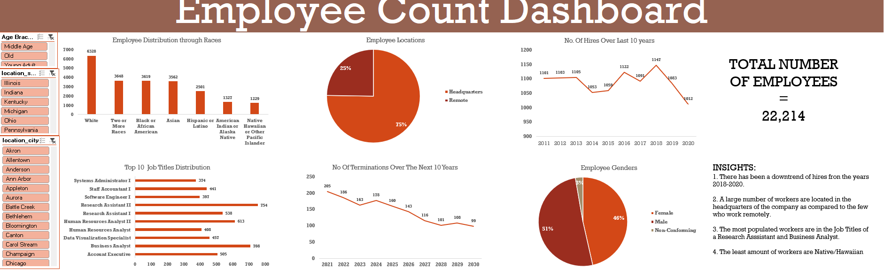

# 👥 Employee Count & Workforce Analytics Dashboard (Excel)

## Project Overview
This project analyzes workforce demographics and employment trends using Microsoft Excel.  
The goal of the analysis was to understand employee distribution, hiring trends, workforce diversity, and job role distribution across the organization.

The dashboard provides insights into workforce composition, employee locations, hiring patterns, and job title distribution.

---

# Dataset
The dataset contains employee records including:

- Employee demographics
- Job titles
- Work locations
- Hiring data
- Termination trends
- Gender distribution

The dataset was cleaned and analyzed using Excel to create a comprehensive HR analytics dashboard.

---

# Key Metrics

- **Total Employees:** 22,214
- **Employee Locations:** Headquarters vs Remote
- **Hiring Trends:** Over the last 10 years
- **Termination Trends:** Forecast for the next 10 years

---

# Dashboard Features

## Workforce Demographics
The dashboard analyzes employee distribution across different demographic categories, including race and gender.

## Employee Location Analysis
A breakdown of employees working:

- At company headquarters
- Remotely

This helps understand workplace distribution.

## Hiring Trends
A time series chart shows the **number of hires over the past decade**, helping identify growth or decline in recruitment activity.

## Job Title Distribution
A bar chart highlights the **top job roles in the organization**, showing which positions are most common.

## Termination Trends
A forecast of employee terminations over the next 10 years helps evaluate workforce stability.

---

# Key Insights

- Hiring activity declined between 2018 and 2020.
- Most employees work at company headquarters rather than remotely.
- Research Assistant and Business Analyst are among the most common job titles.
- Native/Hawaiian employees represent the smallest demographic group in the dataset.

---

# Tools Used
- Microsoft Excel
- Pivot Tables
- Data Cleaning
- Dashboard Design
- Data Visualization

---

# Dashboard Preview

---

# Skills Demonstrated
- HR Data Analysis
- Workforce Analytics
- Data Visualization
- Pivot Table Analysis
- Dashboard Development
